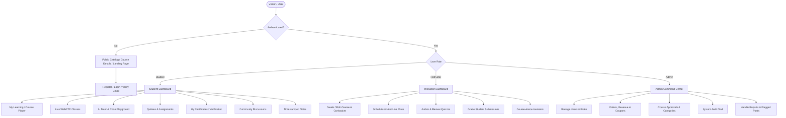
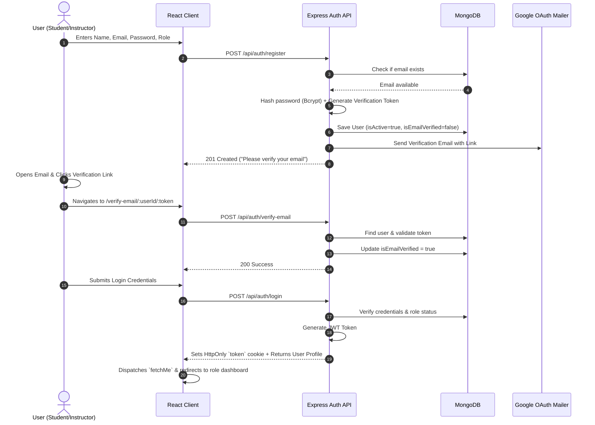
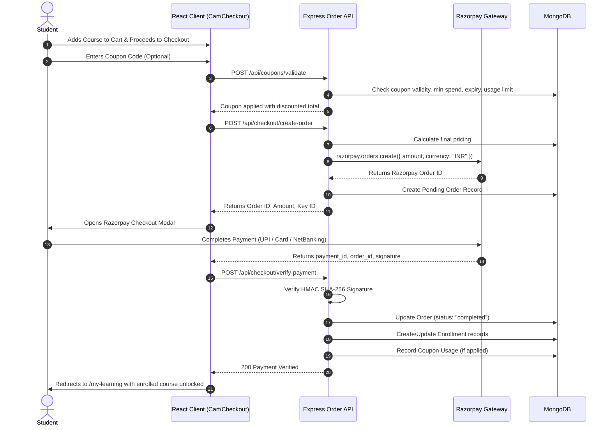
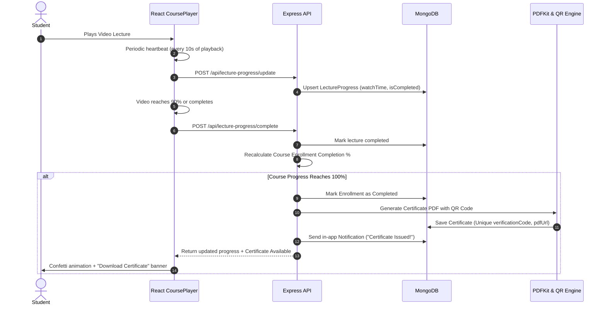
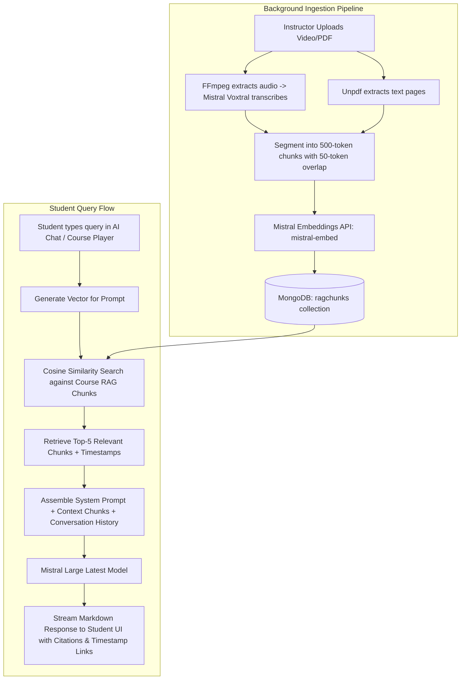
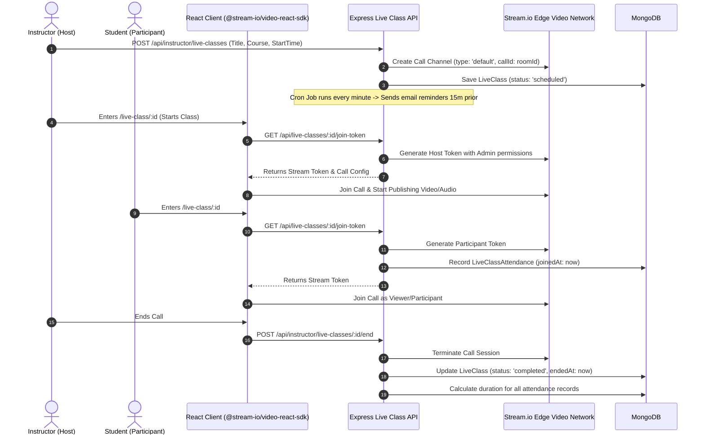
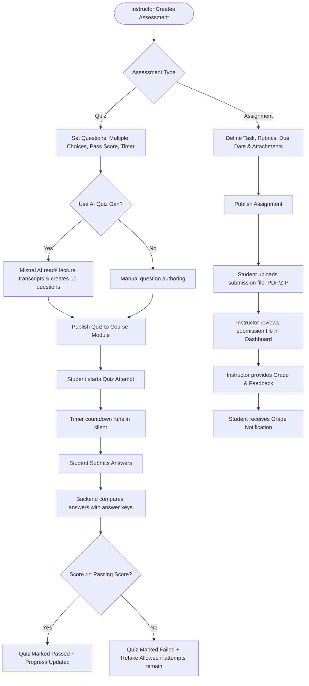

# NavGujarat Academy — Application Flows & User Journeys

**Document Version:** 2.0.0  
**Target:** Visual & Architectural User Flows across All Roles  
**Status:** Approved for Production  

---

## 1. Overall System Architecture & Role Navigation Map

---

## 2. Authentication & Email Verification Journey

---

## 3. Course Enrollment, Coupon & Razorpay Checkout Flow

---

## 4. Course Player, Granular Progress & Certificate Issuance

---

## 5. Multimodal AI Assistant & RAG Knowledge Search

---

## 6. Real-Time Live WebRTC Classroom Flow

---

## 7. Assessment Engine & Grading Lifecycle

