# NavGujarat Academy — Backend Database Schema Reference (36 Models)

**Document Version:** 2.1.0  
**Database Engine:** MongoDB 7.0+ with Mongoose 9.8.0 ORM  
**Total Registered Collections/Models:** 36  
**Status:** Approved for Production  

---

## 1. Complete Entity Relationship Diagram (ERD)

```mermaid
erDiagram
    USER ||--o{ ENROLLMENT : enrolls
    USER ||--o{ ORDER : places
    USER ||--o{ COURSE_REVIEW : writes
    USER ||--o{ STUDENT_NOTE : creates
    USER ||--o{ CERTIFICATE : earns
    USER ||--o{ QUIZ_ATTEMPT : attempts
    USER ||--o{ ASSIGNMENT_SUBMISSION : submits
    USER ||--o{ DISCUSSION : authors
    USER ||--o{ DISCUSSION_REPLY : replies
    USER ||--o{ DISCUSSION_VOTE : votes
    USER ||--o{ DISCUSSION_REPORT : reports
    USER ||--o{ LIVE_CLASS_ATTENDANCE : logs
    USER ||--o{ NOTIFICATION : receives
    USER ||--o{ NOTIFICATION_PREFERENCE : configures
    USER ||--o{ CART_ITEM : adds
    USER ||--o{ WISHLIST : saves
    USER ||--o{ AI_CONVERSATION : chats
    USER ||--o{ AUDIT_LOG : triggers

    CATEGORY ||--o{ COURSE : categorizes
    USER ||--o{ COURSE : instructs

    COURSE ||--o{ COURSE_MODULE : contains
    COURSE_MODULE ||--o{ LECTURE : contains
    LECTURE ||--o{ LECTURE_PROGRESS : tracks
    LECTURE ||--o{ RAG_CHUNK : indexes
    LECTURE ||--o{ RAG_INDEXING_JOB : monitors

    COURSE ||--o{ QUIZ : assesses
    QUIZ ||--o{ QUIZ_QUESTION : contains
    QUIZ ||--o{ QUIZ_ATTEMPT : evaluated_in
    QUIZ_ATTEMPT ||--o{ QUIZ_ANSWER : includes

    COURSE ||--o{ ASSIGNMENT : assigns
    ASSIGNMENT ||--o{ ASSIGNMENT_SUBMISSION : receives

    COURSE ||--o{ LIVE_CLASS : schedules
    LIVE_CLASS ||--o{ LIVE_CLASS_ATTENDANCE : tracks

    COURSE ||--o{ ANNOUNCEMENT : broadcasts
    ANNOUNCEMENT ||--o{ ANNOUNCEMENT_READ : receipts

    COUPON ||--o{ COUPON_USAGE : tracks
    ORDER ||--o{ COUPON_USAGE : applies
    AI_CONVERSATION ||--o{ AI_MESSAGE : messages
```

---

## 2. Exhaustive Schema Specifications for All 36 Models

---

### Group 1: Identity, Users & Preferences (2 Models)

#### 1. `User` (`users`)
| Field | Type | Modifiers / Constraints | Description |
|---|---|---|---|
| `_id` | ObjectId | Primary Key | Unique user identifier |
| `fullName` | String | required, trim, maxLength: 100 | Legal/Display name |
| `email` | String | required, unique, lowercase, index | Normalized email |
| `password` | String | required | Bcrypt hashed password |
| `role` | String | enum: `['student', 'instructor', 'admin']`, default: `'student'` | Access privilege level |
| `avatarUrl` | String | default: `null` | ImageKit URL for profile image |
| `bio` | String | default: `""`, maxLength: 1000 | User biography |
| `status` | String | enum: `['active', 'suspended', 'inactive']`, default: `'active'` | Account state |
| `isActive` | Boolean | default: `true`, index | Active toggle |
| `isEmailVerified`| Boolean | default: `false` | Email verification flag |
| `verificationToken`| String| default: `null` | Expiring verification token |
| `resetPasswordToken`| String| default: `null` | Password reset hash |
| `resetPasswordExpires`| Date| default: `null` | Password reset expiration |
| `timestamps` | Date | `createdAt`, `updatedAt` | Automatic Mongoose timestamps |

#### 2. `NotificationPreference` (`notificationpreferences`)
| Field | Type | Modifiers / Constraints | Description |
|---|---|---|---|
| `user` | ObjectId | ref: `User`, required, unique: true, index | Preference owner |
| `inApp.announcement` | Boolean | default: `true` | In-app announcement alerts |
| `inApp.assignment` | Boolean | default: `true` | In-app assignment alerts |
| `inApp.assignment_graded` | Boolean | default: `true` | In-app grading alerts |
| `inApp.quiz` | Boolean | default: `true` | In-app quiz alerts |
| `inApp.quiz_result` | Boolean | default: `true` | In-app quiz score alerts |
| `inApp.certificate` | Boolean | default: `true` | In-app certificate award alerts |
| `inApp.live_class` | Boolean | default: `true` | In-app live class alerts |
| `inApp.course_update` | Boolean | default: `true` | In-app curriculum change alerts |
| `inApp.discussion` | Boolean | default: `true` | In-app discussion thread alerts |
| `inApp.discussion_reply` | Boolean | default: `true` | In-app reply alerts |
| `inApp.answer_accepted` | Boolean | default: `true` | In-app answer accepted alerts |
| `inApp.system` | Boolean | default: `true` | In-app system alerts |
| `email.*` | Boolean | (Mirrors inApp categories, customizable) | Email delivery toggles |

---

### Group 2: Course & Content Hierarchy (4 Models)

#### 3. `Category` (`categories`)
| Field | Type | Modifiers / Constraints | Description |
|---|---|---|---|
| `name` | String | required, unique, trim | Category display name |
| `slug` | String | required, unique, lowercase | URL slug |
| `icon` | String | default: `null` | Lucide icon identifier |
| `description` | String | default: `""` | Category summary |

#### 4. `Course` (`courses`)
| Field | Type | Modifiers / Constraints | Description |
|---|---|---|---|
| `title` | String | required, trim, maxLength: 200 | Course title |
| `slug` | String | required, unique, lowercase | URL slug |
| `description` | String | required | Full markdown course description |
| `instructor` | ObjectId | ref: `User`, required, index | Course author |
| `category` | ObjectId | ref: `Category`, required, index | Primary category |
| `price` | Number | required, min: 0 | Course retail price in INR |
| `discountPrice` | Number | default: 0, min: 0 | Promotional discounted price |
| `thumbnail` | String | required | ImageKit CDN image URL |
| `level` | String | enum: `['beginner', 'intermediate', 'advanced', 'all']` | Course level |
| `language` | String | default: `'English'` | Spoken language |
| `status` | String | enum: `['draft', 'published', 'archived']`, default: `'draft'` | Publication lifecycle |
| `averageRating` | Number | default: 0, min: 0, max: 5 | Aggregate average rating |
| `totalRatings` | Number | default: 0 | Total review count |
| `totalStudents` | Number | default: 0 | Total student enrollment count |
| `tags` | [String] | default: `[]` | Search index tags |

#### 5. `CourseModule` (`coursemodules`)
| Field | Type | Modifiers / Constraints | Description |
|---|---|---|---|
| `course` | ObjectId | ref: `Course`, required, index | Parent course |
| `title` | String | required, trim | Section title |
| `order` | Number | required, default: 0 | Display sequence order |

#### 6. `Lecture` (`lectures`)
| Field | Type | Modifiers / Constraints | Description |
|---|---|---|---|
| `module` | ObjectId | ref: `CourseModule`, required, index | Parent module |
| `course` | ObjectId | ref: `Course`, required, index | Parent course |
| `title` | String | required, trim | Lecture name |
| `videoUrl` | String | default: `null` | CDN video stream URL |
| `duration` | Number | default: 0 (seconds) | Lecture length in seconds |
| `order` | Number | required, default: 0 | Display order |
| `isPreview` | Boolean | default: `false` | Unlocked trial access flag |
| `documentUrl` | String | default: `null` | Supplementary PDF/doc URL |
| `transcript` | String | default: `""` | Voxtral transcript text |
| `isIndexed` | Boolean | default: `false` | RAG vector status flag |

---

### Group 3: Progression, Reviews & Notes (4 Models)

#### 7. `Enrollment` (`enrollments`)
| Field | Type | Modifiers / Constraints | Description |
|---|---|---|---|
| `student` | ObjectId | ref: `User`, required, index | Enrolled user |
| `course` | ObjectId | ref: `Course`, required, index | Target course |
| `progress` | Number | default: 0, min: 0, max: 100 | Percentage progress |
| `isCompleted` | Boolean | default: `false` | Completion status |
| `completedAt` | Date | default: `null` | Completion date |
| `certificateIssued` | Boolean | default: `false` | Certificate generated flag |
| **Index** | Compound | `{ student: 1, course: 1 }` (unique: true) | Unique enrollment record |

#### 8. `LectureProgress` (`lectureprogresses`)
| Field | Type | Modifiers / Constraints | Description |
|---|---|---|---|
| `student` | ObjectId | ref: `User`, required, index | Student |
| `lecture` | ObjectId | ref: `Lecture`, required, index | Target lecture |
| `course` | ObjectId | ref: `Course`, required, index | Parent course |
| `watchTime` | Number | default: 0 (seconds) | Total seconds watched |
| `isCompleted` | Boolean | default: `false` | Lecture completion flag |
| **Index** | Compound | `{ student: 1, lecture: 1 }` (unique: true) | Single progress per lecture |

#### 9. `CourseReview` (`coursereviews`)
| Field | Type | Modifiers / Constraints | Description |
|---|---|---|---|
| `course` | ObjectId | ref: `Course`, required, index | Target course |
| `student` | ObjectId | ref: `User`, required, index | Reviewing student |
| `rating` | Number | required, min: 1, max: 5 | Star score |
| `comment` | String | required, trim, maxLength: 2000 | Feedback text |
| **Index** | Compound | `{ course: 1, student: 1 }` (unique: true) | One review per course per student |

#### 10. `StudentNote` (`studentnotes`)
| Field | Type | Modifiers / Constraints | Description |
|---|---|---|---|
| `student` | ObjectId | ref: `User`, required, index | Author student |
| `lecture` | ObjectId | ref: `Lecture`, required, index | Target lecture |
| `course` | ObjectId | ref: `Course`, required, index | Target course |
| `timestamp` | Number | default: 0 (seconds) | Playback timestamp |
| `content` | String | required, trim | Markdown note body |
| `tags` | [String] | default: `[]` | Category tags |

---

### Group 4: Assessments — Quizzes & Assignments (6 Models)

#### 11. `Quiz` (`quizzes`)
| Field | Type | Modifiers / Constraints | Description |
|---|---|---|---|
| `course` | ObjectId | ref: `Course`, required, index | Parent course |
| `module` | ObjectId | ref: `CourseModule`, default: `null` | Associated module |
| `title` | String | required, trim | Quiz title |
| `description` | String | default: `""` | Instructions |
| `timeLimitMinutes` | Number | default: 30, min: 1 | Time limit in minutes |
| `passingScorePercentage` | Number | default: 70, min: 0, max: 100 | Pass threshold |
| `totalQuestions` | Number | default: 0 | Number of questions |
| `maxAttempts` | Number | default: 3 | Maximum allowed attempts |
| `isPublished` | Boolean | default: `false` | Visibility flag |

#### 12. `QuizQuestion` (`quizquestions`)
| Field | Type | Modifiers / Constraints | Description |
|---|---|---|---|
| `quiz` | ObjectId | ref: `Quiz`, required, index | Parent quiz |
| `questionText` | String | required, trim | Question prompt |
| `questionType` | String | enum: `['single', 'multiple', 'boolean']`, default: `'single'` | Answer format |
| `options` | Array | `[{ text: String, isCorrect: Boolean }]` | Choices |
| `explanation` | String | default: `""` | Post-submission explanation |
| `points` | Number | default: 1, min: 1 | Question weight |

#### 13. `QuizAttempt` (`quizattempts`)
| Field | Type | Modifiers / Constraints | Description |
|---|---|---|---|
| `quiz` | ObjectId | ref: `Quiz`, required, index | Target quiz |
| `student` | ObjectId | ref: `User`, required, index | Attempting student |
| `course` | ObjectId | ref: `Course`, required, index | Parent course |
| `scorePercentage` | Number | default: 0 | Final percentage |
| `totalPointsEarned` | Number | default: 0 | Earned score |
| `passed` | Boolean | default: `false` | Passed status |
| `startedAt` | Date | default: `Date.now` | Attempt start time |
| `submittedAt` | Date | default: `null` | Attempt submission time |

#### 14. `QuizAnswer` (`quizanswers`)
| Field | Type | Modifiers / Constraints | Description |
|---|---|---|---|
| `attempt` | ObjectId | ref: `QuizAttempt`, required, index | Parent attempt |
| `question` | ObjectId | ref: `QuizQuestion`, required, index | Target question |
| `selectedOptionIndices` | [Number] | default: `[]` | Chosen answers |
| `isCorrect` | Boolean | default: `false` | Evaluation flag |
| `pointsAwarded` | Number | default: 0 | Earned points |

#### 15. `Assignment` (`assignments`)
| Field | Type | Modifiers / Constraints | Description |
|---|---|---|---|
| `course` | ObjectId | ref: `Course`, required, index | Parent course |
| `instructor` | ObjectId | ref: `User`, required, index | Author instructor |
| `title` | String | required, trim | Assignment topic |
| `description` | String | required | Detailed instructions |
| `rubric` | String | default: `""` | Grading criteria |
| `attachmentUrl` | String | default: `null` | Template/resource file |
| `dueDate` | Date | required | Submission deadline |
| `maxScore` | Number | default: 100, min: 1 | Maximum score |

#### 16. `AssignmentSubmission` (`assignmentsubmissions`)
| Field | Type | Modifiers / Constraints | Description |
|---|---|---|---|
| `assignment` | ObjectId | ref: `Assignment`, required, index | Parent task |
| `student` | ObjectId | ref: `User`, required, index | Submitting student |
| `fileUrl` | String | required | Uploaded work (PDF/ZIP) |
| `fileName` | String | default: `""` | File name |
| `submittedAt` | Date | default: `Date.now` | Submission timestamp |
| `grade` | Number | default: `null` | Assigned score |
| `feedback` | String | default: `""` | Instructor comments |
| `status` | String | enum: `['submitted', 'graded', 'resubmit']`, default: `'submitted'` | Grading state |

---

### Group 5: Real-time Live Classes & Attendance (2 Models)

#### 17. `LiveClass` (`liveclasses`)
| Field | Type | Modifiers / Constraints | Description |
|---|---|---|---|
| `course` | ObjectId | ref: `Course`, required, index | Parent course |
| `instructor` | ObjectId | ref: `User`, required, index | Host instructor |
| `title` | String | required, trim | Class title |
| `description` | String | default: `""` | Agenda summary |
| `scheduledStartTime` | Date | required, index | Scheduled start |
| `scheduledEndTime` | Date | required | Scheduled end |
| `roomId` | String | required, unique | Stream.io call ID |
| `status` | String | enum: `['scheduled', 'live', 'completed', 'cancelled']`, default: `'scheduled'` | Session state |
| `recordingUrl` | String | default: `null` | Cloud video recording |

#### 18. `LiveClassAttendance` (`liveclassattendances`)
| Field | Type | Modifiers / Constraints | Description |
|---|---|---|---|
| `liveClass` | ObjectId | ref: `LiveClass`, required, index | Target session |
| `student` | ObjectId | ref: `User`, required, index | Attendee |
| `joinedAt` | Date | required | Join timestamp |
| `leftAt` | Date | default: `null` | Leave timestamp |
| `durationMinutes` | Number | default: 0 | Time spent |
| `attended` | Boolean | default: `true` | Minimum attendance qualification |

---

### Group 6: Announcements & Read Receipts (2 Models)

#### 19. `Announcement` (`announcements`)
| Field | Type | Modifiers / Constraints | Description |
|---|---|---|---|
| `course` | ObjectId | ref: `Course`, default: `null`, index | Course scope (null = platform-wide) |
| `instructor` | ObjectId | ref: `User`, required, index | Author |
| `title` | String | required, trim | Subject line |
| `content` | String | required | Markdown body |
| `isPinned` | Boolean | default: `false` | Sticky post toggle |

#### 20. `AnnouncementRead` (`announcementreads`)
| Field | Type | Modifiers / Constraints | Description |
|---|---|---|---|
| `announcement` | ObjectId | ref: `Announcement`, required, index | Target announcement |
| `user` | ObjectId | ref: `User`, required, index | Reader |
| `readAt` | Date | default: `Date.now` | Read receipt timestamp |
| **Index** | Compound | `{ announcement: 1, user: 1 }` (unique: true) | Single receipt per user |

---

### Group 7: Community Discussions & Moderation (4 Models)

#### 21. `Discussion` (`discussions`)
| Field | Type | Modifiers / Constraints | Description |
|---|---|---|---|
| `course` | ObjectId | ref: `Course`, required, index | Course forum |
| `author` | ObjectId | ref: `User`, required, index | Thread creator |
| `title` | String | required, trim | Thread subject |
| `content` | String | required | Question / issue body |
| `tags` | [String] | default: `[]` | Category tags |
| `upvotesCount` | Number | default: 0 | Total upvotes |
| `repliesCount` | Number | default: 0 | Total replies |
| `isPinned` | Boolean | default: `false` | Pinned by instructor |
| `isSolved` | Boolean | default: `false` | Has accepted answer |

#### 22. `DiscussionReply` (`discussionreplies`)
| Field | Type | Modifiers / Constraints | Description |
|---|---|---|---|
| `discussion` | ObjectId | ref: `Discussion`, required, index | Parent thread |
| `author` | ObjectId | ref: `User`, required, index | Reply author |
| `content` | String | required | Reply body |
| `isInstructorReply` | Boolean | default: `false` | Instructor badge |
| `isAcceptedAnswer` | Boolean | default: `false` | Marked as solution |
| `upvotesCount` | Number | default: 0 | Reply upvotes |

#### 23. `DiscussionVote` (`discussionvotes`)
| Field | Type | Modifiers / Constraints | Description |
|---|---|---|---|
| `itemType` | String | enum: `['discussion', 'reply']`, required | Target entity |
| `itemId` | ObjectId | required, index | Target entity ID |
| `user` | ObjectId | ref: `User`, required, index | Voter |
| **Index** | Compound | `{ itemType: 1, itemId: 1, user: 1 }` (unique: true) | One vote per item |

#### 24. `DiscussionReport` (`discussionreports`)
| Field | Type | Modifiers / Constraints | Description |
|---|---|---|---|
| `reportedItemType` | String | enum: `['discussion', 'reply']`, required | Target entity |
| `reportedItemId` | ObjectId | required, index | Reported ID |
| `reporter` | ObjectId | ref: `User`, required, index | Reporting user |
| `reason` | String | required, trim | Reason for report |
| `status` | String | enum: `['pending', 'resolved', 'dismissed']`, default: `'pending'` | Moderation state |
| `resolvedBy` | ObjectId | ref: `User`, default: `null` | Admin who resolved |

---

### Group 8: Notifications (1 Model)

#### 25. `Notification` (`notifications`)
| Field | Type | Modifiers / Constraints | Description |
|---|---|---|---|
| `recipient` | ObjectId | ref: `User`, required, index | Receiver |
| `sender` | ObjectId | ref: `User`, default: `null` | Initiator |
| `type` | String | required, index | Event type (`'announcement'`, `'grade'`, etc.) |
| `title` | String | required | Notification header |
| `message` | String | required | Notification body |
| `link` | String | default: `""` | In-app navigation URL |
| `isRead` | Boolean | default: `false`, index | Read status |

---

### Group 9: E-Commerce, Cart, Wishlist, Orders & Coupons (6 Models)

#### 26. `CartItem` (`cartitems`)
| Field | Type | Modifiers / Constraints | Description |
|---|---|---|---|
| `user` | ObjectId | ref: `User`, required, index | Cart owner |
| `course` | ObjectId | ref: `Course`, required, index | Target course |
| **Index** | Compound | `{ user: 1, course: 1 }` (unique: true) | Single item per course in cart |

#### 27. `Wishlist` (`wishlists`)
| Field | Type | Modifiers / Constraints | Description |
|---|---|---|---|
| `user` | ObjectId | ref: `User`, required, index | Wishlist owner |
| `course` | ObjectId | ref: `Course`, required, index | Target course |
| **Index** | Compound | `{ user: 1, course: 1 }` (unique: true) | Single item per course in wishlist |

#### 28. `Order` (`orders`)
| Field | Type | Modifiers / Constraints | Description |
|---|---|---|---|
| `orderNumber` | String | required, unique | Human-readable order reference |
| `user` | ObjectId | ref: `User`, required, index | Purchasing customer |
| `items` | Array | `[{ course: ref, price: Number }]` | Course items |
| `subtotal` | Number | required | Total before discount |
| `discountAmount` | Number | default: 0 | Deducted discount |
| `totalAmount` | Number | required | Final paid price |
| `coupon` | ObjectId | ref: `Coupon`, default: `null` | Used coupon |
| `paymentGateway` | String | default: `'razorpay'` | Gateway name |
| `paymentId` | String | default: `null` | Razorpay payment ID |
| `razorpayOrderId` | String | default: `null` | Razorpay order ID |
| `status` | String | enum: `['pending', 'completed', 'failed', 'refunded']`, default: `'pending'` | Payment status |

#### 29. `Coupon` (`coupons`)
| Field | Type | Modifiers / Constraints | Description |
|---|---|---|---|
| `code` | String | required, unique, uppercase, trim | Promo code |
| `discountType` | String | enum: `['percentage', 'flat']`, required | Math discount model |
| `discountValue` | Number | required, min: 1 | % or INR value |
| `minOrderAmount` | Number | default: 0 | Threshold spend |
| `maxDiscountAmount` | Number | default: 0 | Cap for percentage discounts |
| `validFrom` | Date | required | Start validity |
| `validUntil` | Date | required | Expiration |
| `usageLimit` | Number | default: 100 | Total allowed claims |
| `usedCount` | Number | default: 0 | Number of times claimed |
| `isActive` | Boolean | default: `true`, index | Active toggle |

#### 30. `CouponUsage` (`couponusages`)
| Field | Type | Modifiers / Constraints | Description |
|---|---|---|---|
| `coupon` | ObjectId | ref: `Coupon`, required, index | Target coupon |
| `user` | ObjectId | ref: `User`, required, index | Redeeming student |
| `order` | ObjectId | ref: `Order`, required, index | Associated order |
| `usedAt` | Date | default: `Date.now` | Timestamp of use |

---

### Group 10: Certificates (1 Model)

#### 31. `Certificate` (`certificates`)
| Field | Type | Modifiers / Constraints | Description |
|---|---|---|---|
| `verificationCode` | String | required, unique, index | Cryptographic UUID |
| `student` | ObjectId | ref: `User`, required, index | Recipient |
| `course` | ObjectId | ref: `Course`, required, index | Completed course |
| `issueDate` | Date | default: `Date.now` | Award timestamp |
| `pdfUrl` | String | required | Cloud PDF URL |
| `qrCodeUrl` | String | required | Cloud QR URL |
| `gradeAverage` | Number | default: 100 | Final grade average |

---

### Group 11: AI Assistant & Multimodal RAG Engine (4 Models)

#### 32. `AiConversation` (`aiconversations`)
| Field | Type | Modifiers / Constraints | Description |
|---|---|---|---|
| `user` | ObjectId | ref: `User`, required, index | Owner |
| `course` | ObjectId | ref: `Course`, default: `null`, index | Scope |
| `title` | String | default: `'New Conversation'` | Topic summary |

#### 33. `AiMessage` (`aimessages`)
| Field | Type | Modifiers / Constraints | Description |
|---|---|---|---|
| `conversation` | ObjectId | ref: `AiConversation`, required, index | Thread ref |
| `role` | String | enum: `['user', 'assistant', 'system']`, required | Origin |
| `content` | String | required | Markdown text |
| `citations` | Array | `[{ lectureId, timestamp, text }]` | Verified citations |

#### 34. `RagChunk` (`ragchunks`)
| Field | Type | Modifiers / Constraints | Description |
|---|---|---|---|
| `course` | ObjectId | ref: `Course`, required, index | Course scope |
| `lecture` | ObjectId | ref: `Lecture`, default: `null`, index | Origin lecture |
| `sourceType` | String | enum: `['transcript', 'document', 'description']` | Content type |
| `content` | String | required | Text chunk (<= 500 tokens) |
| `embedding` | [Number] | required | 1024-dim float vector |
| `startSeconds` | Number | default: 0 | Start seek timestamp |
| `endSeconds` | Number | default: 0 | End seek timestamp |

#### 35. `RagIndexingJob` (`ragindexingjobs`)
| Field | Type | Modifiers / Constraints | Description |
|---|---|---|---|
| `course` | ObjectId | ref: `Course`, required, index | Course |
| `resourceType` | String | enum: `['course', 'module', 'lecture', 'document', 'note']` | Ingestion type |
| `resourceId` | ObjectId | required, index | Target resource |
| `status` | String | enum: `['pending', 'processing', 'completed', 'failed']`, default: `'pending'` | Job status |
| `chunksCreated` | Number | default: 0 | Extracted chunks |
| `retryCount` | Number | default: 0 | Retries |
| `lastError` | String | default: `null` | Error traceback |
| `createdBy` | ObjectId | ref: `User`, required | Initiator |
| `isActive` | Boolean | default: `true`, index | Active job |

---

### Group 12: Audit Logging (1 Model)

#### 36. `AuditLog` (`auditlogs`)
| Field | Type | Modifiers / Constraints | Description |
|---|---|---|---|
| `actor` | ObjectId | ref: `User`, required, index | Performing user |
| `action` | String | required | Action type |
| `targetModel` | String | required | Modified collection |
| `targetId` | ObjectId | required | Modified document ID |
| `details` | Object | default: `{}` | Change diff |
| `ipAddress` | String | default: `""` | Client IP |
| `userAgent` | String | default: `""` | User Agent |
| `createdAt` | Date | index | Event timestamp |
