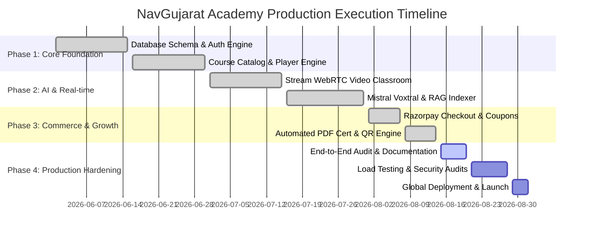

# NavGujarat Academy — Master Implementation Plan & Engineering Roadmap

**Document Version:** 2.0.0  
**Target:** Engineering, QA, DevOps & Product Operations  
**Status:** Approved for Execution  

---

## 1. Phased Milestone Execution Roadmap



---

## 2. Detailed Work Breakdown Structure (WBS)

### 2.1 Backend Engineering Streams
- **Stream A (Auth & Identity):**
  - Robust JWT cookie authentication with token rotation.
  - Google OAuth SMTP transactional emailer with HTML templates for verification and password reset.
  - Rate limiting tiers (`authLimiter`, `globalLimiter`, `orderLimiter`, `aiLimiter`).
- **Stream B (Content & Curriculum Delivery):**
  - Course, Module, and Lecture CRUD with nested reordering logic.
  - Video stream optimization with ImageKit CDN.
  - Lecture progress tracking with heartbeat sync and auto-completion recalculations.
- **Stream C (Assessments & Live Streaming):**
  - Assessment engine: Quizzes (automated scoring) & Assignments (rubric submissions).
  - Stream.io WebRTC token provisioning, room orchestration, and attendance tracking.
  - Live class background reminder cron job (`liveClassReminder.job.js`).
- **Stream D (AI & RAG Multimodal Pipeline):**
  - FFmpeg audio isolation and Mistral Voxtral transcription engine.
  - PDF document text extraction via `unpdf`.
  - 500-token chunking, Mistral embeddings generation, and MongoDB vector indexing.
  - Cosine similarity vector search and multi-turn conversational AI tutor.
- **Stream E (Commerce, Certifications & Governance):**
  - Razorpay order lifecycle with cryptographic signature verification.
  - Dynamic coupon validation and usage limit tracking.
  - Vector PDF certificate generator with embedded QR verification links.
  - Admin audit logger capturing state diffs and IP addresses.

### 2.2 Frontend Engineering Streams
- **Stream F (UI/UX Design System):**
  - Centralized CSS tokens (`--vp-primary`, `--vp-surface`, `--vp-bg`, etc.).
  - Responsive layouts with desktop sidebars and mobile bottom sheets.
  - Smooth micro-interactions, toast notifications (`react-hot-toast`), and loaders.
- **Stream G (Student Experience):**
  - Distraction-free Course Player with collapsible curriculum and tabbed panels.
  - Interactive Code Playground with multi-language execution.
  - Real-time AI chat drawer with Markdown rendering and video seeking links.
  - Community Q&A forum with upvoting, accepted answer badges, and reporting.
- **Stream H (Instructor & Admin Portals):**
  - Intuitive Course & Curriculum Builder with drag-and-drop hierarchy.
  - Live class host dashboard with participant management.
  - Admin Command Center with revenue metrics, user governance, and audit trails.

---

## 3. Quality Assurance & Testing Strategy

| Level | Scope | Framework / Tools | Target Coverage |
|---|---|---|---|
| **Unit Testing** | Services, Validators, Helpers, Redux Reducers | Jest / Vitest | `>= 85%` statement coverage |
| **Integration Testing** | API Routes, Middlewares, Database Transactions | Supertest + MongoMemoryServer | All critical business flows |
| **End-to-End (E2E)** | User Signup -> Purchase -> Player -> Cert Issuance | Playwright / Cypress | 100% critical user paths |
| **Security Testing** | Dependency vulnerabilities, NoSQL Injection, XSS | `npm audit`, OWASP ZAP, Snyk | Zero High/Critical CVEs |
| **Performance & Load** | API latency under 5,000 concurrent students | k6 / Artillery | P95 latency `< 250ms` |

---

## 4. Deployment, CI/CD & Infrastructure Topology

```
+-------------------------------------------------------------------------+
|                                CI/CD Pipeline                           |
|  GitHub Push -> Lint & Typecheck -> Automated Tests -> Docker Image Build|
+------------------------------------+------------------------------------+
                                     |
                +--------------------+--------------------+
                |                                         |
+---------------v---------------+         +---------------v---------------+
|        Frontend Hosting       |         |        Backend Hosting        |
|    Vercel Edge Global CDN     |         |  Render / AWS ECS Cluster     |
|   (SPA + Static Asset Caching)|         | (Node.js Cluster Auto-scaled) |
+-------------------------------+         +---------------+---------------+
                                                          |
                                          +---------------+---------------+
                                          |                               |
                                  +-------v-------+               +-------v-------+
                                  | MongoDB Atlas |               | ImageKit CDN  |
                                  | (Replica Set) |               | Media Storage |
                                  +---------------+               +---------------+
```

---

## 5. Rollout Checklist & Launch Readiness

- [x] All 36 database models indexed with compound unique keys.
- [x] All 44 API route groups secured behind rate limiters and auth middlewares.
- [x] Environment variable validator configured in `backend/src/config/config.js`.
- [x] WebRTC live class token exchange verified with Stream.io.
- [x] Multimodal RAG audio extraction and embedding pipelines verified.
- [x] Razorpay payment signature verification and webhook listeners tested.
- [x] PDFKit certificate generator with QR codes tested across screen sizes.
- [x] Cross-origin CORS policies locked down for production domains.
